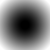
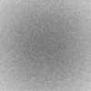
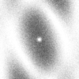
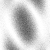
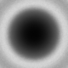

# nanoBragg

program for calculation of absolute scattering from molecules and small crystals

This short program calculates the absolute-scale scattering from a nanocrystal
that is "bathed" in a beam of a given integrated photon density 
(specified in photons/meter<sup>2</sup>). For example, 10<sup>12</sup> photons
focused into a 3-micron round beam is represented by "-fluence 1.4e24". Images 
of the expected photons/pixel on the detector, with and without photon-counting
noise are generated in SMV format (suitable for display with
[ADXV](http://www.scripps.edu/~arvai/adxv.html),
[MOSFLM](http://www.mrc-lmb.cam.ac.uk/harry/mosflm/),
or most any other diffraction image display program).

The structure factor of the spots should be provided on an absolute "electron" scale (as output by programs like
[phenix.fmodel](http://www.phenix-online.org/documentation/fmodel.htm),
[REFMAC](http://www.ccp4.ac.uk/dist/html/refmac5/keywords/xray-general.html#labout), or 
[SFALL](http://www.ccp4.ac.uk/dist/html/sfall.html)), but must
be converted to a plain text file of h,k,l,F.  Note that no symmetry is imposed by this
program, not even Friedel symmetry, so all reflections you wish to be non-zero intensity must be
specified, including F000. The unit cell and crystal orientation may be provided as a 
[MOSFLM](http://www.mrc-lmb.cam.ac.uk/harry/mosflm/)-style
orientation matrix, which is again a text file and the first nine tokens read from it are taken
as the x,y,z components of the three reciprocal-space cell vectors 
(a,b,c are the columns, x,y,z are the rows). 

The program also contains an option for adding approximate scattering from the water droplet
presumed to be surrounding the nanocrystal.  The diameter of this droplet in microns is provided
with the "-water" option, and assumes a forward-scattering structure factor of 2.57 electrons.
The default value for this option is zero.

## source

source code: [nanoBragg.c](nanoBragg.c) (49k) or binaries for 
<a href=nanoBragg.Linux>linux</a>, 
<a href=nanoBragg.Darwin>OSX</a>, 
<a href=nanoBragg.Cygwin>Cygwin</a>,
<a href=nanoBragg.exe>Windows</a>
<a href=nanoBraggCUDA>CUDA</a>

## auxillary programs:

[UBtoA.awk](UBtoA.awk) can be used to generate a MOSFLM -style orientation matrix, and

[mtz_to_P1hkl.com](mtz_to_P1hkl.com) is a script for converting mtz-formatted structure factors into
a format that nanoBragg can read.

<a href=../bin_stuff/noisify.html>noisify</a>
is a program that takes the "photons/pixel" noiseless intensity values output by nonBragg or 
<a href=../nanoBragg>nanoBragg</a>, or <a href=../nearBragg>nearBragg</a> as "floagimage.bin"
and adds different kinds of noise to it to generate an SMV file.  This is usually faster than re-running
nonBragg just to change things like beam intensity.  In addition to photon shot noise, noisify 
has a few kinds of noise that nonBragg
doesn't implement, such as pixel read-out noise, beam flicker, and calibration error.

<a href =../bin_stuff/float_add.html>float_add</a> may be used to
add the raw "float" binary files output by nonBragg, nanoBragg, or even <a href=../nearBragg>nearBragg</a>
 so that renderings may be divided up on separate CPUs and then
combined together.  The resulting raw files may then be converted to SMV images with 
<a href=../bin_stuff/noisify.html>noisify</a>.<br>
<a href =../bin_stuff/float_func.html>float_func</a> can perform a large number of operations on these "floagimage.bin" files.<br>
<a href=../nonBragg/nonBragg.html>nonBragg</a> 
is for generating scattering from amorphous substances, like water and air. 
You will need to feed it a text file containing the "structure factor"
of the amorphous material vs sin(theta)/lambda.  A few examples are:<br>
<a href=air.stol>air.stol</a>
<a href=He.stol>He.stol</a>
<a href=ice.stol>ice.stol</a>
<a href=nanoice.stol>nanoice.stol</a>
<a href=Paratone-N.stol>Paratone-N.stol</a>
<a href=water.stol>water.stol</a>
<br>


## example usage:

compile it

```
gcc -O -O -o nanoBragg nanoBragg.c -lm -static
```

get some structure factor data

```
getcif.com 3pcq
```

refine to get Fs on an absolute scale

```
refmac5 hklin 3pcq.mtz xyzin 3pcq.pdb hklout refmacout.mtz xyzout refmacout.pdb << EOF | tee refmac.log
REFI TYPE RIGID
TWIN
EOF
```

extract the (de-twinned) calculated Fs, which are always 100% complete:

```
mtz_to_P1hkl.com refmacout.mtz FC_ALL_LS
```

make a random orientation matrix:

```
./UBtoA.awk << EOF | tee A.mat
CELL 281 281 165.2 90 90 120 
WAVE 6.2
RANDOM
EOF
```

run the simulation of a 10x10x10 unit cell crystal

```
./nanoBragg -hkl P1.hkl -matrix A.mat -lambda 6.2 -N 10
```

view the result

```
adxv intimage.img
```

convert and re-scale as regular graphics file

```
convert -depth 16 -type Grayscale -colorspace GRAY -endian LSB -size 1024x1024+512 -negate \ 
-normalize GRAY:intimage.img
```


Note the "low resolution hole", which is due to the missing low-angle data in the PDB deposition.
Missing high-resolution spots that would otherwise fall on the detector will generate a WARNING
message in the program output and potentially undefined spot intensities, so make sure you "fill" 
the resolution of interest in the P1.hkl file.

Note also that this image is very clear, with lots of inter-Bragg spot subsidiary peaks.
That is because it is a noiseless simulation.

Now have a look at the "noiseimage.img" which is scaled so that one pixel 
unit is one photon:

```
adxv noiseimage.img
```

It has been re-scaled here as a png for better viewing:


Still not bad, but this is because there is no background, and the default fluence is 1e24,
 or 10<sup>12</sup> photons focused into a 1 micron beam.

Now lets do something more realistic. The fluence of a 10<sup>12</sup>-photon pulse focused into
a 7 micron beam is 2e22 photons/m<sup>2</sup>.  Also, the liquid jet used by 
[Chapman et al (2010)](http://www.nature.com/nature/journal/v470/n7332/full/nature09750.html)
was four microns wide:

```
./nanoBragg -hkl P1.hkl -matrix A.mat -lambda 6.2 -N 10 -fluence 2e22 -water 4
```

visualize results:

```
adxv noiseimage.img
```




If you look closely, you can see the spots.  Note that this is an idealized case where only
photon-counting noise is present.  there is no detector read-out noise, no point-spread function,
no amplifier drift, no pixel saturation and no calibration errors.  Many of these errors
can be added using <a href=noisify.c>noisify.c</a>, but not all.  Watch this space for updates.

# SAXS simulations

nanoBragg can also be used to simulate small-angle X-ray scattering (SAXS) patterns by
simply setting the number of unit cells to one (-N 1 on the command line).
Tricubic interpolation between the hkl indicies will be used to determine the intensity
between the "spots".

## example usage:

get lysozyme

```
getcif.com 193l
```

refine to get the solvent parameters

```
phenix.refine 193l.pdb 193l.mtz | tee phenix_refine.log
```

Now put these atoms into a very big unit cell. It is important that this cell be
at least 3-4 times bigger than your molecule in all directions.  Otherwise, you will
get neigbor-interference effects.  Most people don't want that in their SAXS patterns.

```
pdbset xyzin 193l.pdb xyzout bigcell.pdb << EOF
CELL 250 250 250 90 90 90
SPACEGROUP 1
EOF
```

calculate structure factors of the molecule isolated in a huge "bath" of the
best-fit solvent.

```
phenix.fmodel bigcell.pdb high_resolution=10 \
 k_sol=0.35 b_sol=46.5 mask.solvent_radius=0.5 mask.shrink_truncation_radius=0.16
```

note that this procedure will fill the large cell with a solvent of average
electron density 0.35 electrons/A^3. The old crystallographic contacts
will be replaced with the same solvent boundary model that fit the solvent
channels in the crystal structure.

now we need to convert these Fs into a format nanoBragg can read

```
mtz_to_P1hkl.com bigcell.pdb.mtz
```

and create a random orientation matrix

```
./UBtoA.awk << EOF | tee bigcell.mat
CELL 250 250 250 90 90 90 
WAVE 1
RANDOM
EOF
```

and now, make the diffraction image

```
./nanoBragg -mat bigcell.mat -hkl P1.hkl -lambda 1 -dispersion 0 \
  -distance 1000 -detsize 100 -pixel 0.1 \
  -hdiv 0 -vdiv 0 \
  -fluence 1e32 -N 1
```

visualize the results:

```
adxv noiseimage.img
```



Notice that the center of the image is white. This is not a beamstop!  What is
actually going on is that F000 is missing in P1.hkl, and so is being replaced with
zero intensity.  You can fix this by adding an F000 term:

```
echo "0 0 0 520" >> P1.hkl
./nanoBragg -mat bigcell.mat -hkl P1.hkl -lambda 1 -dispersion 0 \
  -distance 1000 -detsize 100 -pixel 0.1 \
  -hdiv 0 -vdiv 0 \
  -fluence 1e32 -N 1
```

then visualize:

```
adxv noiseimage.img
```



You might wonder, however, why the F000 term is ~500 and not the number of electrons
in lysozyme, which is ~8000. The reason here is the bulk solvent. The volume of
water displaced by the lysozyme molecule contains almost as many electrons as the
lysozyme molecule itself. Protein, however, is slightly denser, and so there are
an extra ~520 electrons "peeking" above the average density of the solvent.

Of course, most real SAXS patterns are centrosymmetric because they are an average
over trillions of molecules in solution, each in a random orientation.  The SAXS 
pattern generated here is for a single molecule exposed to 1e34 photons/m<sup>2</sup>, 
but this is equivalent to 1e18 photons focused onto an area
barely larger than the molecule!  However, 1e12 photons focused onto a 100x100
micron area (1e20 phm<sup>2</sup>) containing 1e14 molecules will generate a pattern 
of similar intensity level, albeit rotationally averaged.

One way to simulate such images would be to use this program to generate a few
thousand or million orientations and then average the results.  This could be instructive
for exploring fluctuation SAXS. However, a much faster way would
be to pre-average the squared structure factors to form a new P1.hkl file, and then
generate one image with a "-fluence" equal to the actual fluence, multiplied by the
number of exposed molecules.  A convenient script for doing this is:

```
mtz_to_stol.com bigcell.pdb.mtz
```

which will create a file called [mtz.stol](mtz.stol) that you can feed to nonBragg:

```
./nonBragg -stol mtz.stol -lambda 1 -dispersion 0 \
  -distance 1000 -detsize 100 -pixel 0.1 \
  -hdiv 0 -vdiv 0 \
  -flux 1e13 -thick 1.2 -MW 14000 -density 0.01
```

then visualize the results:

```
adxv noiseimage.img
```



Which starts to look more like a SAXS pattern from a conventional SAXS beamline.  Note that
the "density" of the sample in this case is 0.01 g/cm^3 or 10 mg/mL.

## Command-line options:

***-hkl filename.hkl***

  the structure factor text list.  Default: re-read dumpfile from last run

<dl>
<dt> -hkl filename.hkl <dt>
<dd> the structure factor text list.  Default: re-read dumpfile from last run <dd>
<dt> -matrix auto.mat <dt>
<dd> cell/orientation matrix file, takes first nine text numbers found <dd>
<dt> -cell a b c alpha beta gamma<dt>
<dd> specify unit cell dimensions (Angstrom and degrees)<dd>
<dt> -misset <dt>
<dd> instead of matrix, specify MOSFLM-style misseting angles about x,y,z (degrees)<dd>

<dt> -Na <dt>
<dd> number of unit cells along crystal a axis <dd>
<dt> -Nb <dt>
<dd> number of unit cells along crystal b axis <dd>
<dt> -Nc <dt>
<dd> number of unit cells along crystal c axis <dd>
<dt> -N <dt>
<dd> number of unit cells in all three directions (ovverides above) <dd>
<dt> -samplesize <dt>
<dd> alternative: linear dimension of the crystal in all three directions (mm) <dd>
<dt> -sample_thick or -sample_x ; -sample_width or -sample_y ; -sample_height or -sample_z <dt>
<dd> alternative: linear dimension of the crystal in specified directions (mm) <dd>


<dt> -img filename.img <dt>
<dd> optional: inherit and interpret header of an existing SMV-format diffraction image file<dd>
<dt> -distance <dt>
<dd> distance from sample to beam center on detector (mm) <dd>
<dt> -close_distance <dt>
<dd> distance from sample to nearest point in detector plane, XDS-style (mm) <dd>
<dt> -detsize <dt>
<dd> detector size in x and y (mm) <dd>
<dt> -detsize_x <dt>
<dd> detector size in x direction (mm) <dd>
<dt> -detsize_y <dt>
<dd> detector size in y direction (mm) <dd>
<dt> -pixel <dt>
<dd> detector pixel size (mm) <dd>
<dt> -detpixels <dt>
<dd> detector size in x and y (pixels) <dd>
<dt> -detpixels_x <dt>
<dd> detector size in x direction (pixels) <dd>
<dt> -detpixels_y <dt>
<dd> detector size in y direction (pixels) <dd>
<dt> -Xbeam <dt>
<dd> direct beam position in x direction (mm) Default: center <dd>
<dt> -Ybeam <dt>
<dd> direct beam position in y direction (mm) Default: center <dd>
<dt> -Xclose  -Yclose <dt>
<dd> instead of beam center, specify point on detector closest to the sample (mm) Default: derive from Xbeam Ybeam <dd>
<dt> -ORGX -ORGY<dt>
<dd> instead of beam center, specify XDS-stype point on detector closest to the sample (pixels) Default: derive from Xbeam Ybeam <dd>

<dt> -detector_rotx -detector_roty -detector_rotz <dt>
<dd> specify detector mis-orientation rotations about x,y,z axes (degrees)<dd>
<dt> -twotheta <dt>
<dd> specify detector rotation about sample (degrees)<dd>
<dt> -pivot sample|beam <dt>
<dd> specify if detector rotations should be about the crystal or about the beam center point on the detector surface <dd>

<dt> -xdet_vector -ydet_vector -zdet_vector -beam_vector -polar_vector -spindle_axis -twotheta_axis <dt>
<dd> explicity define unit vectors defining detector and beam orientation (XDS style) <dd>
<dt> -pix0_vector <dt>
<dd> explicity define XYZ coordinate of the first pixel in the output file (as printed in the output) <dd>

<dt> -curved_det <dt>
<dd> all detector pixels same distance from sample (origin) <dd>
<dt> -oversample <dt>
<dd> number of sub-pixels per pixel. Default: 1 <dd>
<dt> -roi xmin xmax ymin ymax <dt>
<dd> only render pixels within a set range. Default: all detector <dd>
<dt> -mask mask.img <dt>
<dd> optional: skip over pixels that have zero value in a provided SMV-format image file<dd>

<dt> -lambda <dt>
<dd> incident x-ray wavelength (Angstrom). Default: 1 <dd>
<dt> -fluence <dt>
<dd> incident x-ray intensity (photons/m^2). Default: 1.26e29 so I=F^2 <dd>
<dt> -flux <dt>
<dd> incident x-ray intensity (photons/s). Default: none <dd>
<dt> -exposure <dt>
<dd> exposure time (s) used to convert flux and beam size to fluence. Default: 1 <dd>
<dt> -beamsize <dt>
<dd> linear size of incident x-ray beam at sample (mm). Default: 0.1 <dd>

<dt> -hdivrange <dt>
<dd> horizontal angular spread of source points (mrad). Default: 0 <dd>
<dt> -vdivrange <dt>
<dd> vertical angular spread of source points (mrad). Default: 0 <dd>
<dt> -hdivstep <dt>
<dd> number of source points in the horizontal. Default: 1 <dd>
<dt> -vdivstep <dt>
<dd> number of source points in the vertical. Default: 1 <dd>
<dt> -round_div -square_div <dt>
<dd> make the 2D divergence distribution round or square. Default: round <dd>

<dt> -dispersion <dt>
<dd> spectral dispersion: delta-lambda/lambda (percent). Default: 0 <dd>
<dt> -dispsteps <dt>
<dd> number of wavelengths in above range. Default: 1 <dd>

<dt> -sourcefile <dt>
<dd> optionally specify a text file containing x,y,z,relative_intensity,wavelength of each desired point source <dd>
<dt> -coherent <dt>
<dd> coherently add everything, even different wavelengths. Not the default <dd>

<dt> -mosaic <dt>
<dd> simulate mosaic spread with random points on a spherical cap of specified diameter (degrees). Default: 0 <dd>
<dt> -mosaic_domains <dt>
<dd> number of discrete mosaic domains to render. Default: 10 if mosaic>0 recommend a lot more <dd>

<dt> -phi -osc -phistep or -phisteps <dt>
<dd> simulate a spindle rotation about the spindle axis by averaging a series of stills. Default: 0 <dd>
<dt> -phistep <dt>
<dd> angular step for simulating phi spindle rotation (deg). Default: derive from phisteps <dd>
<dt> -phisteps <dt>
<dd> number of steps for simulating phi spindle rotation (). Default: 2 if osc>0 recommend a lot more <dd>


<dt> -floatfile <dt>
<dd> name of binary pixel intensity output file (4-byte floats) <dd>
<dt> -intfile <dt>
<dd> name of smv-formatted output file. <dd>
<dt> -pgmfile <dt>
<dd> name of pgm-formatted output file. <dd>
<dt> -noisefile <dt>
<dd> name of smv-formatted output file containing photon-counting noise. <dd>

<dt> -nonoise <dt>
<dd> do not calculate noise or output noisefile <dd>
<dt> -nopgm <dt>
<dd> do not output pgm file <dd>

<dt> -scale <dt>
<dd> scale factor for intfile. Default: fill dynamic range <dd>
<dt> -pgmscale <dt>
<dd> scale factor for the pgm output file. Default: fill dynamic range <dd>

<dt> -adcoffset <dt>
<dd> specify the zero-photon level in the output images. Default: 40 <dd>


<dt> -point_pixel <dt>
<dd> turn off solid-angle correction for square flat pixels <dd>
<dt> -printout <dt>
<dd> print pixel values out to the screen <dd>
<dt> -noprogress <dt>
<dd> turn off the progress meter <dd>
<dt> -nointerpolate <dt>
<dd> turn off the tricubic interpolation <dd>
<dt> -interpolate <dt>
<dd> turn on the tricubic interpolation, even for crystals <dd>
<dt> -round_xtal <dt>
<dd> use ellipsoidal crystal shape for spot shape calculation (approximate) <dd>
<dt> -square_xtal <dt>
<dd> use paralelpiped crystal shape for spot shape calculation (exact) <dd>
<dt> -binary_spots <dt>
<dd> cut off every spot at the FWHM, even intensity inside. not the default <dd>

<dt> -seed <dt>
<dd> manually set the random number seed. Default: <dd>
<dt> -mosaic_seed <dt>
<dd> different random number seed for mosaic domain generation. Default: <dd>

</dl>

<br>
<br>
</html>
