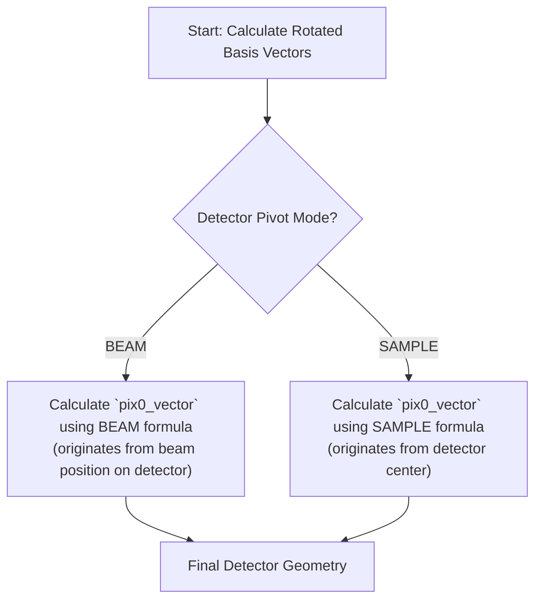

# Detector Architecture Deep Dive

**Status:** Authoritative Specification

This document provides the complete technical specification for the Detector component. For global project rules on units and coordinate systems, see `docs/architecture/conventions.md`.

---

## 1. Convention-Dependent Logic

The behavior of several geometric parameters is dependent on the `detector_convention` setting. The following table summarizes all convention-specific logic.

| Convention | Initial Fast Axis (`fdet_vec`) | Initial Slow Axis (`sdet_vec`) | Beam Vector | `twotheta` Axis (Default) |
| :--- | :--- | :--- | :--- | :--- |
| **MOSFLM** | `[0, 0, 1]` | `[0, -1, 0]` | `[1, 0, 0]` | `[0, 0, -1]` (Ref: `nanoBragg.c:1194`) |
| **XDS** | `[1, 0, 0]` | `[0, 1, 0]` | `[0, 0, 1]` | `[1, 0, 0]` (Ref: `nanoBragg.c:1221`) |

**CRITICAL:** The default `twotheta_axis` for the `MOSFLM` convention is non-intuitive and **MUST** be implemented as `[0, 0, -1]`.

---

## 2. Logic Flow: `pix0_vector` Calculation

The calculation of the detector's origin vector (`pix0_vector`) is critically dependent on the `detector_pivot` mode.

---

## 3. Rotation Order

Detector rotations are applied first (`rotx`, `roty`, `rotz`), followed by the `twotheta` rotation.