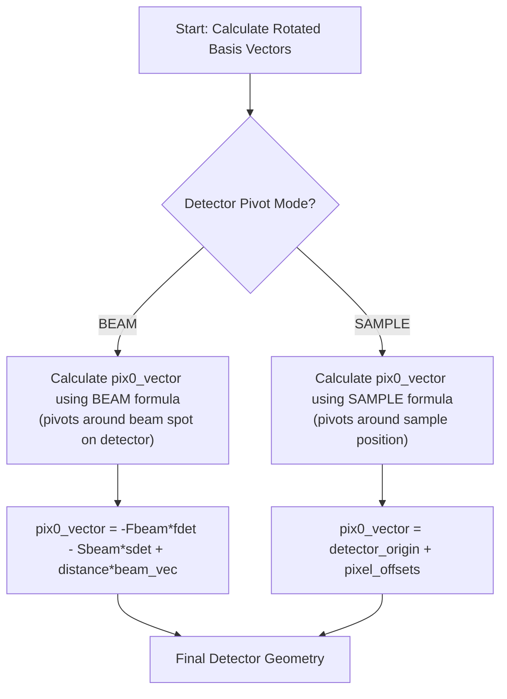

# Detector Architecture Deep Dive

**Status:** Authoritative Specification  
**Last Updated:** Phase 5 Implementation

**⚠️ CRITICAL:** This component uses a [hybrid unit system](#61-critical-hybrid-unit-system-overrides-global-rule) that overrides the global Angstrom-only rule.

This document provides the complete technical specification for the Detector component. For global project rules on units and coordinate systems, see [Global Conventions](./conventions.md).

---

## 1. Overview

The Detector class manages the detector geometry for diffraction simulations, including:
- Position and orientation (basis vectors)
- Pixel coordinate generation and caching
- Support for various detector conventions (MOSFLM, XDS)
- Dynamic geometry with rotations and tilts
- Full differentiability for optimization workflows

## 2. Coordinate System (pointer)

Canonical coordinate system, indexing, and meshgrid conventions are defined in `specs/spec-a.md` (Geometry & Conventions) and summarized for tensors in `docs/architecture/conventions.md`. This doc does not restate them.

## 3. Convention-Dependent Logic (pointer)

For basis initializations, convention defaults (MOSFLM/XDS/etc.), and default `twotheta_axis`, defer to:
- `specs/spec-a.md` (Geometry Model & Conventions)
- `arch.md` (Geometry Model & Conventions)

## 4. Rotation Order and Transformations (pointer)

Rotation order and axis selection are specified in the spec/arch. This component follows those contracts without deviation.

## 5. Logic Flow: `pix0_vector` Calculation

The calculation of the detector's origin vector (`pix0_vector`) depends on the `detector_pivot` mode:



### 5.1 BEAM Pivot Mode
When `detector_pivot = BEAM`, the detector rotates around the direct beam spot:
```python
pix0_vector = -Fbeam * fdet_vec - Sbeam * sdet_vec + distance * beam_vector
```
Where:
- `Fbeam = Ybeam + 0.5 * pixel_size` (in MOSFLM convention)
- `Sbeam = Xbeam + 0.5 * pixel_size` (in MOSFLM convention)
- **Critical Mapping**: `beam_center_s` (slow axis) maps to `Xbeam`, `beam_center_f` (fast axis) maps to `Ybeam`

### 5.2 SAMPLE Pivot Mode
When `detector_pivot = SAMPLE`, the detector rotates around the sample:
```python
detector_origin = distance * odet_vec
pix0_vector = detector_origin + s_offset * sdet_vec + f_offset * fdet_vec
```

## 6. Unit Conversion System (pointer)

The detector’s hybrid unit system (mm inputs → meters for geometry → Å for physics) is defined in `specs/spec-a.md` and summarized in `arch.md`. This document avoids repeating those tables; see those sources for canonical conversions and rationale.

## 7. Performance Optimizations

### 7.1 Pixel Coordinate Caching
The detector implements intelligent caching to avoid recalculating pixel coordinates:

```python
# Geometry version tracking
self._geometry_version  # Incremented on geometry changes
self._pixel_coords_cache  # Cached pixel coordinates
self._cached_basis_vectors  # For change detection
```

### 7.2 Cache Invalidation
The cache is invalidated when:
- Basis vectors change (detected via tensor comparison)
- `pix0_vector` changes
- Device or dtype changes

### 7.3 Dtype Neutrality

**Critical Implementation Detail:** Cache retrieval in `get_pixel_coords()` must coerce cached tensors to the current `self.dtype` before comparison to support dynamic dtype switching.

**Mechanism:**
```python
# CORRECT: Coerce device AND dtype
cached_f = self._cached_basis_vectors[0].to(device=self.device, dtype=self.dtype)

# INCORRECT: Only device coercion (causes dtype mismatch crashes)
cached_f = self._cached_basis_vectors[0].to(self.device)  # ❌ Missing dtype
```

**Rationale:**
When `detector.to(dtype=torch.float64)` is called, live geometry tensors (`self.fdet_vec`, etc.) are converted to float64, but cached tensors remain in their original dtype. The `torch.allclose` comparison between float32 cached tensors and float64 live tensors raises `RuntimeError: Float did not match Double`. Coercing cached tensors to `self.dtype` during retrieval ensures type consistency.

**Testing:**
- Validated by `tests/test_at_parallel_013.py` (deterministic mode, float64 precision)
- Validated by `tests/test_at_parallel_024.py` (mosaic rotation with dtype switching)

**Performance Impact:** Negligible — coercion only occurs during cache validation (not on cache hits).

## 8. Differentiability

### 8.1 Differentiable Parameters
All geometric parameters support gradient computation:
- `distance_mm`
- `beam_center_s`, `beam_center_f`
- `detector_rotx_deg`, `detector_roty_deg`, `detector_rotz_deg`
- `detector_twotheta_deg`

### 8.2 Gradient Flow
```
User Parameter (tensor) → Unit Conversion → Basis Vectors → Pixel Coords → Simulation
      ↑                                                                           ↓
      └─────────────────────── Gradient Backpropagation ─────────────────────────┘
```

## 8. Critical Configuration Details

### 8.1 Pivot Mode Selection

**CRITICAL:** The pivot mode determines how the detector rotates and must match the C-code for each test case:

| Test Case | Pivot Mode | C-Code Indicator | DetectorConfig Setting |
| :--- | :--- | :--- | :--- |
| simple_cubic | (default) | No explicit message | `detector_pivot=DetectorPivot.SAMPLE` |
| triclinic_P1 | BEAM | "pivoting detector around direct beam spot" | `detector_pivot=DetectorPivot.BEAM` |
| cubic_tilted_detector | SAMPLE | Explicit beam center given | `detector_pivot=DetectorPivot.SAMPLE` |

**How to Determine Pivot Mode:**
1. Check the C-code trace output for "pivoting detector around direct beam spot" → BEAM pivot
2. If no message appears, check if explicit beam center is given → SAMPLE pivot
3. When in doubt, generate a trace with both modes and compare pixel positions

### 8.2 Beam Center Calculation

**CRITICAL:** Beam center values are physical distances in mm, NOT pixel coordinates.

**MOSFLM/DENZO Default Formula (per spec-a-core.md §71):**
```
Default Xbeam = (detsize_s + pixel)/2
Default Ybeam = (detsize_f + pixel)/2
```

**Examples:**

```python
# For a 512×512 detector with 0.1mm pixels:
# MOSFLM default: (51.2 + 0.1)/2 = 25.65 mm
# Note: The +0.5 pixel mapping offset is applied during mm→pixel conversion
config = DetectorConfig(
    spixels=512,
    fpixels=512,
    pixel_size_mm=0.1,
    beam_center_s=25.65,  # mm from detector edge (MOSFLM default)
    beam_center_f=25.65   # mm from detector edge (MOSFLM default)
)

# For a 1024×1024 detector with 0.1mm pixels:
# MOSFLM default: (102.4 + 0.1)/2 = 51.25 mm
# Mapping to pixels: Fbeam = Ybeam + 0.5·pixel → 51.25 + 0.05 = 51.3 → pixel 513
config = DetectorConfig(
    spixels=1024,
    fpixels=1024,
    pixel_size_mm=0.1,
    beam_center_s=51.25,  # mm from detector edge (MOSFLM default)
    beam_center_f=51.25   # mm from detector edge (MOSFLM default)
)
```

**Common Mistakes:**
- Using pixel coordinates (256, 512) instead of physical distances (25.65mm, 51.25mm)
- Using formula `detsize/2` instead of `(detsize + pixel)/2` for MOSFLM defaults
- Confusing the user-facing beam center (mm) with the internal +0.5 pixel mapping offset

## 9. Example Configurations

### 9.1 Default Detector (simple_cubic compatibility)
```python
# MOSFLM convention (default)
# Default beam center: (detsize + pixel)/2 = (102.4 + 0.1)/2 = 51.25 mm
config = DetectorConfig(
    distance_mm=100.0,
    pixel_size_mm=0.1,
    spixels=1024,
    fpixels=1024,
    beam_center_s=51.25,  # MOSFLM default per spec-a-core.md §71
    beam_center_f=51.25,  # MOSFLM default per spec-a-core.md §71
)
```

### 9.2 Tilted Detector with Two-Theta
```python
config = DetectorConfig(
    distance_mm=100.0,
    detector_rotx_deg=5.0,
    detector_roty_deg=3.0,
    detector_rotz_deg=2.0,
    detector_twotheta_deg=15.0,
    detector_convention=DetectorConvention.MOSFLM,
    detector_pivot=DetectorPivot.BEAM,
)
```

### 9.3 XDS Convention Detector
```python
config = DetectorConfig(
    detector_convention=DetectorConvention.XDS,
    twotheta_axis=[1.0, 0.0, 0.0],  # Custom axis
)
```

## 10. Common Pitfalls and Best Practices

### 10.1 Unit Confusion
**Pitfall:** Mixing mm and Angstrom units  
**Best Practice:** Always use Config classes which handle conversions automatically

### 10.2 Pixel Indexing
**Pitfall:** Assuming pixel centers instead of edges  
**Best Practice:** Remember that integer indices refer to pixel corners

### 10.3 Rotation Order
**Pitfall:** Applying rotations in wrong order  
**Best Practice:** Follow the exact sequence: rotx → roty → rotz → twotheta

### 10.4 Convention Mixing
**Pitfall:** Using MOSFLM beam vector with XDS detector  
**Best Practice:** Ensure all components use consistent conventions

## 11. Testing and Validation

### 11.1 Key Test Cases
1. **Basis Vector Orthonormality:** Verify basis vectors remain orthonormal after rotations
2. **Pixel Coordinate Consistency:** Check `pixel[0,0] == pix0_vector`
3. **Gradient Flow:** Ensure all parameters have non-zero gradients
4. **Convention Switching:** Verify correct behavior for both MOSFLM and XDS

### 11.2 Golden Data Comparison
The `cubic_tilted_detector` test case validates:
- Basis vector calculation matches C-code within `atol=1e-9`
- Pixel coordinates generate expected diffraction patterns
- Detector rotations produce correct geometric transformations

## 12. Future Enhancements

### 12.1 Planned Features
- [ ] Support for non-rectangular detectors
- [ ] Time-dependent detector motion
- [ ] Multi-panel detector support
- [ ] Detector distortion corrections

### 12.2 Performance Improvements
- [ ] GPU-optimized coordinate generation
- [ ] Batch detector configurations
- [ ] Sparse pixel sampling for large detectors
