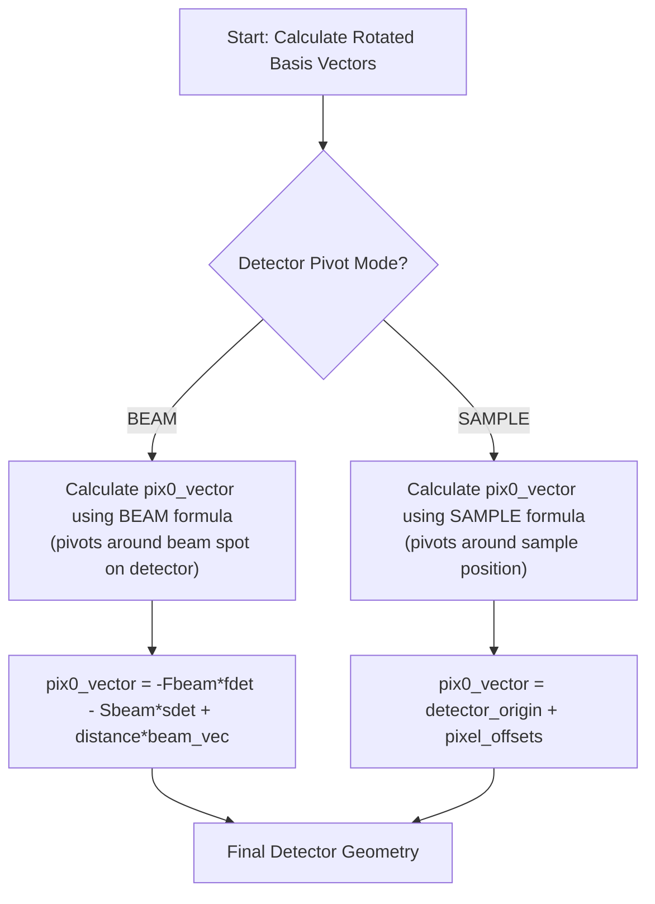

# Detector Architecture Deep Dive

**Status:** Authoritative Specification  
**Last Updated:** Phase 5 Implementation

**⚠️ CRITICAL:** This component uses a [hybrid unit system](#61-critical-hybrid-unit-system-overrides-global-rule) that overrides the global Angstrom-only rule.

This document provides the complete technical specification for the Detector component. For global project rules on units and coordinate systems, see [Global Conventions](./conventions.md).

---

## 1. Overview

The Detector class manages the detector geometry for diffraction simulations, including:
- Position and orientation (basis vectors)
- Pixel coordinate generation and caching
- Support for various detector conventions (MOSFLM, XDS)
- Dynamic geometry with rotations and tilts
- Full differentiability for optimization workflows

## 2. Coordinate System

### 2.1 Lab Frame
- **Origin:** Sample position `(0,0,0)`
- **Primary Axis:** Beam travels along the `+X` axis (MOSFLM convention)
- **Handedness:** Right-handed coordinate system

### 2.2 Pixel Indexing
- **Order:** `(slow, fast)` corresponding to `(row, column)`
- **Reference Point:** All pixel coordinates refer to **pixel centers** (index + 0.5)
- **Meshgrid Convention:** All `torch.meshgrid` calls use `indexing="ij"`

### 2.3 Detector Basis Vectors
- **`fdet_vec`:** Fast axis direction (pixel columns)
- **`sdet_vec`:** Slow axis direction (pixel rows)  
- **`odet_vec`:** Normal axis (points towards/away from source depending on convention)

## 3. Convention-Dependent Logic

The behavior of several geometric parameters depends on the `detector_convention` setting:

| Convention | Initial Fast Axis (`fdet_vec`) | Initial Slow Axis (`sdet_vec`) | Initial Normal Axis (`odet_vec`) | Beam Vector | `twotheta` Axis (Default) |
| :--- | :--- | :--- | :--- | :--- | :--- |
| **MOSFLM** | `[0, 0, 1]` | `[0, -1, 0]` | `[1, 0, 0]` | `[1, 0, 0]` | `[0, 0, -1]` (Ref: `nanoBragg.c:1194`) |
| **XDS** | `[1, 0, 0]` | `[0, 1, 0]` | `[0, 0, 1]` | `[0, 0, 1]` | `[1, 0, 0]` (Ref: `nanoBragg.c:1221`) |

**CRITICAL:** The default `twotheta_axis` for the `MOSFLM` convention is non-intuitive and **MUST** be implemented as `[0, 0, -1]`.

## 4. Rotation Order and Transformations

### 4.1 Rotation Sequence
Detector rotations are applied in a specific order:

```
1. detector_rotx (rotation around X-axis)
2. detector_roty (rotation around Y-axis)  
3. detector_rotz (rotation around Z-axis)
4. detector_twotheta (rotation around arbitrary axis)
```

### 4.2 Rotation Visualization

```
Initial Detector (MOSFLM):
    +Y
    |
    |__ +X (beam)
   /
  +Z

After rotx=45°:
    +Y'
   /|
  / |__ +X (beam)
 /
+Z'

After additional twotheta=15°:
  Detector plane rotated around
  twotheta_axis = [0,0,-1]
```

## 5. Logic Flow: `pix0_vector` Calculation

The calculation of the detector's origin vector (`pix0_vector`) depends on the `detector_pivot` mode:



### 5.1 BEAM Pivot Mode
When `detector_pivot = BEAM`, the detector rotates around the direct beam spot:
```python
pix0_vector = -Fbeam * fdet_vec - Sbeam * sdet_vec + distance * beam_vector
```
Where:
- `Fbeam = Ybeam + 0.5 * pixel_size` (in MOSFLM convention)
- `Sbeam = Xbeam + 0.5 * pixel_size` (in MOSFLM convention)
- **Critical Mapping**: `beam_center_s` (slow axis) maps to `Xbeam`, `beam_center_f` (fast axis) maps to `Ybeam`

### 5.2 SAMPLE Pivot Mode
When `detector_pivot = SAMPLE`, the detector rotates around the sample:
```python
detector_origin = distance * odet_vec
pix0_vector = detector_origin + s_offset * sdet_vec + f_offset * fdet_vec
```

## 6. Unit Conversion System

### ⚠️ 6.1 CRITICAL: Hybrid Unit System (OVERRIDES GLOBAL RULE)

**This section overrides CLAUDE.md Rule #1 ("All internal calculations use Angstroms")**

The Detector component uses a **hybrid unit system** to maintain exact compatibility with the C-code reference implementation:

| Stage | Unit System | Rationale |
| :--- | :--- | :--- |
| **User Input** (`DetectorConfig`) | millimeters (mm) | User-friendly units |
| **Internal Geometry** (positions, distances) | **meters (m)** | C-code compatibility |
| **Output to Physics** (`pixel_coords`) | Angstroms (Å) | Physics engine compatibility |

**Why This Exception Exists:**
- The C-code outputs detector positions like `DETECTOR_PIX0_VECTOR 0.1 0.0257 -0.0257` which are in **meters**
- Converting detector geometry to Angstroms produces values ~10⁹, causing numerical precision issues
- The physics calculations (scattering vectors, Miller indices) correctly require Angstroms

### 6.2 Correct Implementation

```python
# ✅ CORRECT: Detector geometry uses meters internally
class Detector:
    def __init__(self, config):
        # Convert mm to METERS for geometry calculations
        self.distance = config.distance_mm / 1000.0      # 100mm → 0.1m
        self.pixel_size = config.pixel_size_mm / 1000.0  # 0.1mm → 0.0001m
        
    def get_pixel_coords(self):
        # Calculate in meters
        coords_meters = self._calculate_pixel_positions()  # Returns meters
        
        # Convert to Angstroms for physics compatibility
        coords_angstroms = coords_meters * 1e10
        return coords_angstroms

# ❌ WRONG: Using Angstroms for detector geometry
self.distance = mm_to_angstroms(config.distance_mm)  # 100mm → 1e9 Å (WRONG!)
```

### 6.3 Unit Conversion Reference

| Parameter | User Input | Internal Geometry | Output to Physics |
| :--- | :--- | :--- | :--- |
| `distance` | 100.0 mm | 0.1 m | 1e9 Å |
| `pixel_size` | 0.1 mm | 0.0001 m | 1e6 Å |
| `beam_center` | 25.6 mm | 0.0256 m | 2.56e8 Å |
| `pix0_vector` | - | [0.1, 0.0257, -0.0257] m | [1e9, 2.57e8, -2.57e8] Å |

# Beam center conversion (mm to pixels)
self.beam_center_s = config.beam_center_s / config.pixel_size_mm
```

## 7. Performance Optimizations

### 7.1 Pixel Coordinate Caching
The detector implements intelligent caching to avoid recalculating pixel coordinates:

```python
# Geometry version tracking
self._geometry_version  # Incremented on geometry changes
self._pixel_coords_cache  # Cached pixel coordinates
self._cached_basis_vectors  # For change detection
```

### 7.2 Cache Invalidation
The cache is invalidated when:
- Basis vectors change (detected via tensor comparison)
- `pix0_vector` changes
- Device or dtype changes

## 8. Differentiability

### 8.1 Differentiable Parameters
All geometric parameters support gradient computation:
- `distance_mm`
- `beam_center_s`, `beam_center_f`
- `detector_rotx_deg`, `detector_roty_deg`, `detector_rotz_deg`
- `detector_twotheta_deg`

### 8.2 Gradient Flow
```
User Parameter (tensor) → Unit Conversion → Basis Vectors → Pixel Coords → Simulation
      ↑                                                                           ↓
      └─────────────────────── Gradient Backpropagation ─────────────────────────┘
```

## 8. Critical Configuration Details

### 8.1 Pivot Mode Selection

**CRITICAL:** The pivot mode determines how the detector rotates and must match the C-code for each test case:

| Test Case | Pivot Mode | C-Code Indicator | DetectorConfig Setting |
| :--- | :--- | :--- | :--- |
| simple_cubic | (default) | No explicit message | `detector_pivot=DetectorPivot.SAMPLE` |
| triclinic_P1 | BEAM | "pivoting detector around direct beam spot" | `detector_pivot=DetectorPivot.BEAM` |
| cubic_tilted_detector | SAMPLE | Explicit beam center given | `detector_pivot=DetectorPivot.SAMPLE` |

**How to Determine Pivot Mode:**
1. Check the C-code trace output for "pivoting detector around direct beam spot" → BEAM pivot
2. If no message appears, check if explicit beam center is given → SAMPLE pivot
3. When in doubt, generate a trace with both modes and compare pixel positions

### 8.2 Beam Center Calculation

**CRITICAL:** Beam center values are physical distances in mm, NOT pixel coordinates:

```python
# For a 512×512 detector with 0.1mm pixels:
# Center pixel: (256, 256)
# Physical center: 256 × 0.1mm = 25.6mm
config = DetectorConfig(
    spixels=512,
    fpixels=512,
    pixel_size_mm=0.1,
    beam_center_s=25.6,  # mm from detector edge
    beam_center_f=25.6   # mm from detector edge
)

# For a 1024×1024 detector with 0.1mm pixels:
# Center pixel: (512, 512)
# Physical center: 512 × 0.1mm = 51.2mm
config = DetectorConfig(
    spixels=1024,
    fpixels=1024,
    pixel_size_mm=0.1,
    beam_center_s=51.2,  # mm from detector edge
    beam_center_f=51.2   # mm from detector edge
)
```

**Common Mistake:** Using pixel coordinates (256, 512) instead of physical distances (25.6mm, 51.2mm)

## 9. Example Configurations

### 9.1 Default Detector (simple_cubic compatibility)
```python
config = DetectorConfig(
    distance_mm=100.0,
    pixel_size_mm=0.1,
    spixels=1024,
    fpixels=1024,
    beam_center_s=51.2,
    beam_center_f=51.2,
)
```

### 9.2 Tilted Detector with Two-Theta
```python
config = DetectorConfig(
    distance_mm=100.0,
    detector_rotx_deg=5.0,
    detector_roty_deg=3.0,
    detector_rotz_deg=2.0,
    detector_twotheta_deg=15.0,
    detector_convention=DetectorConvention.MOSFLM,
    detector_pivot=DetectorPivot.BEAM,
)
```

### 9.3 XDS Convention Detector
```python
config = DetectorConfig(
    detector_convention=DetectorConvention.XDS,
    twotheta_axis=[1.0, 0.0, 0.0],  # Custom axis
)
```

## 10. Common Pitfalls and Best Practices

### 10.1 Unit Confusion
**Pitfall:** Mixing mm and Angstrom units  
**Best Practice:** Always use Config classes which handle conversions automatically

### 10.2 Pixel Indexing
**Pitfall:** Assuming pixel centers instead of edges  
**Best Practice:** Remember that integer indices refer to pixel corners

### 10.3 Rotation Order
**Pitfall:** Applying rotations in wrong order  
**Best Practice:** Follow the exact sequence: rotx → roty → rotz → twotheta

### 10.4 Convention Mixing
**Pitfall:** Using MOSFLM beam vector with XDS detector  
**Best Practice:** Ensure all components use consistent conventions

## 11. Testing and Validation

### 11.1 Key Test Cases
1. **Basis Vector Orthonormality:** Verify basis vectors remain orthonormal after rotations
2. **Pixel Coordinate Consistency:** Check `pixel[0,0] == pix0_vector`
3. **Gradient Flow:** Ensure all parameters have non-zero gradients
4. **Convention Switching:** Verify correct behavior for both MOSFLM and XDS

### 11.2 Golden Data Comparison
The `cubic_tilted_detector` test case validates:
- Basis vector calculation matches C-code within `atol=1e-9`
- Pixel coordinates generate expected diffraction patterns
- Detector rotations produce correct geometric transformations

## 12. Future Enhancements

### 12.1 Planned Features
- [ ] Support for non-rectangular detectors
- [ ] Time-dependent detector motion
- [ ] Multi-panel detector support
- [ ] Detector distortion corrections

### 12.2 Performance Improvements
- [ ] GPU-optimized coordinate generation
- [ ] Batch detector configurations
- [ ] Sparse pixel sampling for large detectors