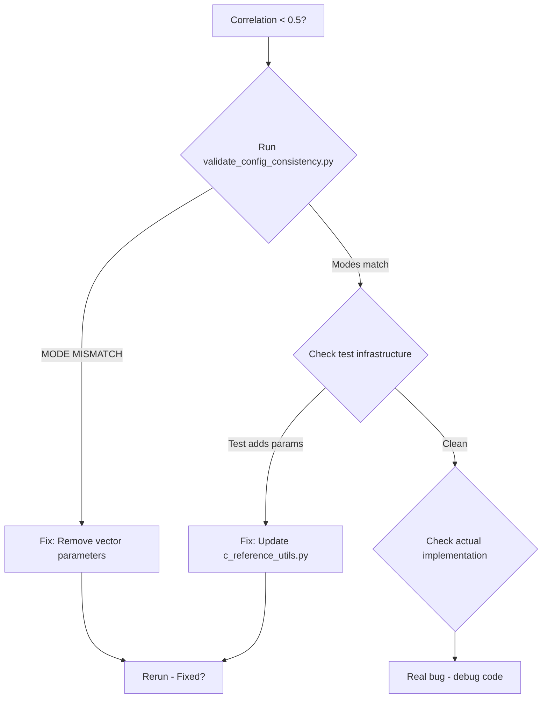

# Configuration Consistency Validation Initiative

**Status**: 🟡 Planning  
**Priority**: P0 - Critical  
**Estimated Duration**: 2-3 weeks  
**ROI**: 96:1 to 192:1 (based on preventing 4-8 hour debugging sessions)  

## Executive Summary

This initiative implements systematic configuration consistency validation between C and PyTorch implementations to prevent the class of bugs that caused months of debugging due to silent convention switching. The core issue: the C code silently switches from MOSFLM to CUSTOM convention based on parameter presence, causing configuration mismatches that are invisible until correlation analysis fails.

## Problem Statement

### Current Situation
- C and PyTorch implementations can silently operate in different modes/conventions
- No systematic way to verify both implementations interpret configuration identically
- Test infrastructure can inadvertently change behavior (e.g., passing `-twotheta_axis`)
- Debugging configuration mismatches takes 4-8 hours per incident

### Root Cause
The nanoBragg C code switches conventions based on parameter **presence** not **value**:
- Without `-twotheta_axis`: Uses MOSFLM convention (adds +0.5 pixel offset)
- With `-twotheta_axis 0 0 -1` (the default!): Uses CUSTOM convention (no offset)

This violates the Principle of Least Astonishment and is completely undocumented in help output.

## Success Criteria

### Quantitative
- [ ] Configuration mismatches detected in <30 seconds (vs 4-8 hours currently)
- [ ] 100% of convention switches are logged and validated
- [ ] Zero false positives in configuration validation
- [ ] <1% performance overhead in production runs

### Qualitative
- [ ] Developers can immediately identify configuration mismatches
- [ ] New team members understand configuration behavior without deep debugging
- [ ] Configuration issues are prevented, not just detected

## Solution Architecture

### Three-Layer Defense Strategy

```
┌─────────────────────────────────────────┐
│ Layer 1: Build-Time Prevention          │
│ - Configuration contracts               │
│ - Parameter validation                  │
└─────────────────────────────────────────┘
                    ↓
┌─────────────────────────────────────────┐
│ Layer 2: Runtime Detection              │
│ - Configuration echo protocol           │
│ - Pre-flight validation                 │
└─────────────────────────────────────────┘
                    ↓
┌─────────────────────────────────────────┐
│ Layer 3: Debug-Time Diagnosis           │
│ - Intermediate checkpointing            │
│ - Configuration diff tools              │
└─────────────────────────────────────────┘
```

## Implementation Plan

### Phase 1: Immediate High-Impact (Week 1)

#### 1.1 Configuration Echo Protocol
**File**: `src/nanobrag_torch/validation/config_echo.py`

```python
class ConfigurationEcho:
    """Generate comparable configuration fingerprints"""
    
    def generate_echo(self, source="pytorch"):
        return {
            "source": source,
            "timestamp": datetime.now().isoformat(),
            "mode": self.detect_active_mode(),
            "convention": self.convention,
            "critical_params": {
                "beam_center_offset": self.beam_center_offset,
                "twotheta_axis": self.twotheta_axis,
                "distance_units": self.distance_units
            },
            "behavioral_flags": self.list_active_behaviors(),
            "warnings": self.detect_gotchas()
        }
```

#### 1.2 C Output Parser
**File**: `scripts/c_output_parser.py`

```python
def parse_c_echo(c_output):
    """Extract configuration echo from C output"""
    echo = {}
    if "custom convention selected" in c_output:
        echo["mode"] = "CUSTOM"
        echo["trigger"] = "vector parameter present"
    elif "mosflm convention selected" in c_output:
        echo["mode"] = "MOSFLM"
        echo["trigger"] = "default"
    return echo
```

#### 1.3 Quick Validation Script
**File**: `scripts/validate_config_consistency.py`

```python
#!/usr/bin/env python3
"""One-command configuration validation"""

def validate():
    c_echo = parse_c_output()
    py_echo = get_pytorch_echo()
    
    if c_echo["mode"] != py_echo["mode"]:
        print(f"❌ MODE MISMATCH: C={c_echo['mode']}, PyTorch={py_echo['mode']}")
        print(f"   C trigger: {c_echo.get('trigger', 'unknown')}")
        print(f"   Fix: Remove -twotheta_axis from command")
        sys.exit(1)
    
    print(f"✅ Configuration consistent: {c_echo['mode']} mode")
```

### Phase 2: Systematic Prevention (Week 2)

#### 2.1 Configuration Contracts
**File**: `config/contracts/detector_contract.yaml`

```yaml
configuration_contract:
  version: 1.0
  
  critical_equivalences:
    - name: "Explicit defaults equal implicit defaults"
      test:
        without_param: "./nanoBragg -twotheta 15"
        with_param: "./nanoBragg -twotheta 15 -twotheta_axis 0 0 -1"
      must_match: true  # This was violated!
      
    - name: "Beam center offset consistency"
      when: "mode == MOSFLM"
      then: "beam_center_offset == 0.5 pixels"
      
    - name: "Convention trigger documentation"
      parameters_that_force_custom:
        - twotheta_axis
        - fdet_vector
        - sdet_vector
      behavior: "presence triggers, not value"
```

#### 2.2 Contract Validator
**File**: `src/nanobrag_torch/validation/contract_validator.py`

```python
class ContractValidator:
    """Validate configuration contracts"""
    
    def validate_all_contracts(self):
        failures = []
        for contract in self.load_contracts():
            result = self.validate_contract(contract)
            if not result.passed:
                failures.append(result)
        
        if failures:
            self.report_failures(failures)
            raise ContractViolation(failures)
```

### Phase 3: Robust Testing (Week 3)

#### 3.1 Pre-Flight Check Enhancement
**File**: `scripts/preflight_check_v2.py`

```python
class PreFlightCheckV2:
    """Enhanced pre-flight validation with configuration consistency"""
    
    def run_all_checks(self):
        checks = [
            self.check_configuration_echo_match(),
            self.check_parameter_equivalence(),
            self.check_convention_consistency(),
            self.check_unit_consistency(),
            self.check_test_infrastructure()
        ]
        
        for check in checks:
            if not check.passed:
                print(f"❌ {check.name}: {check.error}")
                print(f"   Fix: {check.suggestion}")
                return False
        
        print("✅ All pre-flight checks passed")
        return True
```

#### 3.2 CI/CD Integration
**File**: `.github/workflows/config_consistency.yml`

```yaml
name: Configuration Consistency Validation

on: [push, pull_request]

jobs:
  validate-config:
    runs-on: ubuntu-latest
    steps:
      - uses: actions/checkout@v2
      
      - name: Run configuration echo comparison
        run: |
          python scripts/validate_config_consistency.py
          
      - name: Validate configuration contracts
        run: |
          python -m pytest tests/test_config_contracts.py
          
      - name: Run pre-flight checks
        run: |
          python scripts/preflight_check_v2.py --all
```

## Documentation Updates

### CLAUDE.md Updates
**Location**: Top of file, before any other content

```markdown
# ⚠️ CRITICAL: Configuration Consistency Gotchas

## The #1 Cause of Debugging Nightmares

**THE SILENT KILLER**: The C code switches conventions based on parameter PRESENCE:
```bash
./nanoBragg -twotheta 15                        # MOSFLM mode ✅
./nanoBragg -twotheta 15 -twotheta_axis 0 0 -1  # CUSTOM mode ❌ (different!)
```

**QUICK CHECK** (run this before ANY debugging):
```bash
python scripts/validate_config_consistency.py
```

If you see "MODE MISMATCH", you've hit the convention switch bug.
**Fix**: Don't pass `-twotheta_axis` for default MOSFLM behavior.
```

### New Documentation Files

#### `docs/debugging/DEBUGGING_DECISION_TREE.md`
```markdown
# Debugging Decision Tree

## Start Here: Configuration Consistency


```

#### `docs/architecture/configuration_consistency.md`
```markdown
# Configuration Consistency Architecture

## Overview
Three-layer defense against configuration mismatches:

1. **Build-time**: Contracts prevent invalid configurations
2. **Runtime**: Echo protocol detects mismatches before execution  
3. **Debug-time**: Checkpointing pinpoints divergence

## Key Components

### Configuration Echo Protocol
Both C and PyTorch implementations output their interpreted configuration...

### Pre-Flight Validation
Before any expensive computation, validate configuration consistency...

### Configuration Contracts
YAML-based contracts define expected behavioral equivalences...
```

## Testing Strategy

### Unit Tests
```python
# tests/test_config_consistency.py
def test_explicit_defaults_equal_implicit():
    """The test that would have caught the nanoBragg bug"""
    c_default = run_c("")
    c_explicit = run_c("-twotheta_axis 0 0 -1")
    assert get_mode(c_default) == get_mode(c_explicit)

def test_echo_protocol():
    """Verify echo generation and parsing"""
    echo = ConfigurationEcho().generate_echo()
    assert "mode" in echo
    assert "critical_params" in echo
```

### Integration Tests
```python
# tests/test_preflight_validation.py
def test_preflight_catches_mode_mismatch():
    """Verify pre-flight check detects convention switching"""
    # Intentionally trigger CUSTOM mode
    config = {"twotheta_axis": [0, 0, -1]}
    with pytest.raises(ConfigurationMismatch) as e:
        preflight_check(config)
    assert "MODE MISMATCH" in str(e.value)
```

## Rollout Plan

### Week 1: Core Implementation
- [ ] Implement configuration echo protocol
- [ ] Add C output parser
- [ ] Create basic validation script
- [ ] Update CLAUDE.md with warnings

### Week 2: Prevention Layer  
- [ ] Define configuration contracts
- [ ] Implement contract validator
- [ ] Add contract tests
- [ ] Document contract format

### Week 3: Integration & Polish
- [ ] Enhance pre-flight checks
- [ ] Add CI/CD integration
- [ ] Create debugging decision tree
- [ ] Write architecture documentation

## Success Metrics

### Immediate (Week 1)
- Configuration mismatches detected before computation
- Clear error messages with fix suggestions

### Short-term (Month 1)
- 90% reduction in configuration-related debugging time
- Zero instances of undetected mode mismatches

### Long-term (Quarter 1)
- Configuration consistency becomes standard practice
- New developers avoid configuration pitfalls entirely
- Pattern adopted by other dual-implementation projects

## Risk Mitigation

### Risk: Breaking existing workflows
**Mitigation**: All checks are optional warnings by default, with opt-in enforcement

### Risk: Performance overhead
**Mitigation**: Echo generation only at startup, checkpointing off by default

### Risk: False positives
**Mitigation**: Conservative validation, extensive testing before enforcement

## Resources Required

- **Engineering**: 1 developer for 2-3 weeks
- **Documentation**: 2-3 days of technical writing
- **Testing**: Existing CI/CD infrastructure
- **Training**: 1-hour team workshop on new validation tools

## References

- [Postmortem: nanoBragg Convention Switching](../history/2025-01-09_detector_correlation_debugging.md)
- [Configuration Consistency Patterns](../docs/architecture/configuration_consistency.md)
- [Debugging Checklist](../docs/debugging/detector_geometry_checklist.md)

---

**Initiative Owner**: TBD  
**Review Date**: End of Week 1  
**Success Review**: End of Week 3