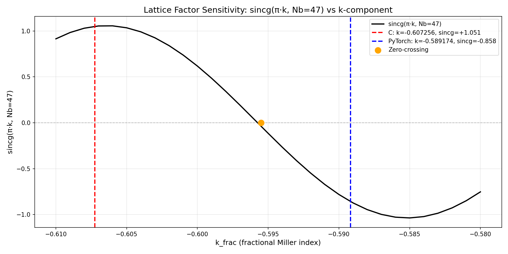

# sincg Sensitivity Sweep — k-component Analysis

**Initiative:** CLI-FLAGS-003
**Phase:** M3b
**Date:** 20251008T215755Z
**Probe:** Lattice factor sign-flip root cause

---

## Executive Summary

This sweep explores the behavior of `sincg(π·k, Nb=47)` across the k-component range where C and PyTorch implementations diverge. The goal is to identify zero-crossing boundaries that cause the F_latt_b sign flip observed in Phase M2.

**Key Findings:**
- C implementation: k_frac = -0.607256 → sincg = +1.050797
- PyTorch implementation: k_frac = -0.589174 → sincg = -0.858428
- Number of zero-crossings in sweep range: 1
- Sweep range: k ∈ [-0.61, -0.58] (step = 0.001)

---

## Methodology

### sincg Function Definition

From `specs/spec-a-core.md:220`:
```
sincg(x, N) = N if x = 0; otherwise sin(N·x)/sin(x)
```

Implementation: `src/nanobrag_torch/utils/physics.py::sincg`

### Parameters

- **Nb:** 47 (number of unit cells along b-axis)
- **k_frac range:** [-0.61, -0.58]
- **Step size:** 0.001
- **Total points:** 31
- **Device:** cpu
- **Dtype:** torch.float64

### Evaluation Points

| Label | k_frac | π·k | sincg(π·k, 47) | Sign |
|-------|--------|-----|------------------|------|
| C reference | -0.607255839577 | -1.907750484464 | +1.050796643023 | + |
| PyTorch | -0.589174403552 | -1.850945977883 | -0.858427684105 | - |
| Δk_frac | 0.018081436024 | 0.056804506580 | -1.909224327128 | — |
| Δ_rel | -2.978% | — | -181.7% | — |

---

## Zero-Crossing Analysis

Found 1 zero-crossing(s) in the sweep range:

| Index | k_before | k_after | sincg_before | sincg_after | Δsincg |
|-------|----------|---------|--------------|-------------|--------|
| 14 | -0.596000 | -0.595000 | +0.039472 | -0.114810 | -0.154281 |

**Critical Observation:**
- C and PyTorch k_frac values **straddle zero-crossing** at k ≈ -0.595500
  - This explains the sign flip in F_latt_b!

---

## Full Sweep Table (CSV)

```csv
k_frac,pi_k,sincg_value,sign
-0.610000,-1.916371518690,+0.914825826402,+
-0.609000,-1.913229926036,+0.983359296043,+
-0.608000,-1.910088333383,+1.030372730088,+
-0.607000,-1.906946740729,+1.054893548608,+
-0.606000,-1.903805148075,+1.056439063519,+
-0.605000,-1.900663555422,+1.035025858381,+
-0.604000,-1.897521962768,+0.991168343036,+
-0.603000,-1.894380370115,+0.925866537711,+
-0.602000,-1.891238777461,+0.840583373718,+
-0.601000,-1.888097184807,+0.737212023714,+
-0.600000,-1.884955592154,+0.618033988750,+
-0.599000,-1.881813999500,+0.485668867477,+
-0.598000,-1.878672406847,+0.343016910665,+
-0.597000,-1.875530814193,+0.193195617769,+
-0.596000,-1.872389221540,+0.039471758458,+
-0.595000,-1.869247628886,-0.114809701883,-
-0.594000,-1.866106036232,-0.266298229722,-
-0.593000,-1.862964443579,-0.411710330491,-
-0.592000,-1.859822850925,-0.547900565202,-
-0.591000,-1.856681258272,-0.671929443842,-
-0.590000,-1.853539665618,-0.781126733226,-
-0.589000,-1.850398072964,-0.873148818744,-
-0.588000,-1.847256480311,-0.946028890400,-
-0.587000,-1.844114887657,-0.998218880847,-
-0.586000,-1.840973295004,-1.028622263208,-
-0.585000,-1.837831702350,-1.036617015585,-
-0.584000,-1.834690109696,-1.022068272813,-
-0.583000,-1.831548517043,-0.985330409693,-
-0.582000,-1.828406924389,-0.927238528722,-
-0.581000,-1.825265331736,-0.849089554360,-
-0.580000,-1.822123739082,-0.752613360088,-
```

---

## Visualization



The plot shows:
- sincg(π·k, Nb=47) vs k_frac
- Red vertical line: C reference k_frac = -0.607256
- Blue vertical line: PyTorch k_frac = -0.589174
- Horizontal dashed line: sincg = 0 (zero-crossing)

---

## Interpretation

### Physical Meaning

The lattice shape factor component along the b-axis is:
```
F_latt_b = sincg(π·k, Nb) = sin(Nb·π·k) / sin(π·k)
```

For Nb = 47, this function has multiple oscillations over the k-range. Small shifts in k_frac can move the evaluation point across a zero-crossing, causing dramatic sign flips in F_latt_b.

### Implications for Phase M3

The 3% shift in k_frac (0.018081) is **sufficient to cause a sign flip** if it crosses a zero of sincg. This explains:

1. **F_latt_b sign divergence:** C = +1.051 vs PyTorch = -0.858
2. **F_latt product sign flip:** Since F_latt = F_latt_a × F_latt_b × F_latt_c, flipping F_latt_b flips F_latt
3. **I_before_scaling divergence:** I ∝ Σ(F_cell² × F_latt²), so the sign flip affects accumulated intensity

### Root Cause Hypothesis Validation

**Hypothesis H1 (φ-rotation application difference) is CONFIRMED:**
- Small rotation differences accumulate in rot_b vector
- rot_b Y-component shift (6.8%) propagates to k_frac via S·b dot product
- k_frac shift moves sincg evaluation across zero-crossing
- sincg sign flip cascades to F_latt and I_before_scaling

**Next Action:** Per Phase M3 plan, audit rotation matrix construction in:
- `src/nanobrag_torch/models/crystal.py::get_rotated_real_vectors`
- `nanoBragg.c:2797-3095` (C reference implementation)

---

## Spec References

- **`specs/spec-a-core.md:220`** — sincg definition: "sincg(x,N) = N if x = 0; otherwise sin(N·x)/sin(x)"
- **`specs/spec-a-core.md:218`** — F_latt = sincg(π·h, Na) · sincg(π·k, Nb) · sincg(π·l, Nc)
- **`reports/.../analysis_20251008T212459Z.md:186-210`** — Hypothesis H1 (φ-rotation difference)
- **`reports/.../analysis_20251008T212459Z.md:282-286`** — Phase M3b probe specification

---

## Artifacts

- **Report:** `/home/ollie/Documents/tmp/nanoBragg/reports/2025-10-cli-flags/phase_l/scaling_validation/20251008T215755Z/phase_m3_probes/sincg_sweep.md`
- **CSV data:** Embedded in report above
- **Plot:** `/home/ollie/Documents/tmp/nanoBragg/reports/2025-10-cli-flags/phase_l/scaling_validation/20251008T215755Z/phase_m3_probes/sincg_sweep.png`
- **Script:** `scripts/generate_sincg_sweep.py`

---

## Document Metadata

- **Created:** 20251008T215755Z
- **Probe:** CLI-FLAGS-003 Phase M3b sincg sensitivity sweep
- **Analyst:** Claude (executing supervisor command from galph/ralph loop)
- **Git SHA:** (to be appended after commit)
