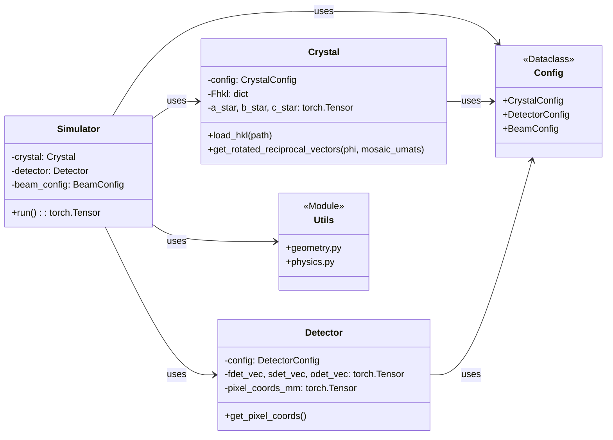

# nanoBragg PyTorch Architecture Design

**Version:** 1.0  
**Date:** 2023-10-27  
**Authors:** [Your Name/Team]

## 1. Introduction & Guiding Principles

This document outlines the software architecture for the PyTorch implementation of `nanoBragg`. The primary goal is to create a functionally equivalent, yet more modern, extensible, and performant simulator that leverages GPU acceleration and automatic differentiation for scientific modeling.

The design is guided by the following principles:

1.  **Object-Oriented Abstraction:** The flat, procedural structure of the C code will be replaced by a set of classes (`Crystal`, `Detector`, `Simulator`) that encapsulate related state and logic. This improves modularity and maintainability.
2.  **Vectorization over Loops:** The core design pattern is to replace the nested C loops with vectorized PyTorch tensor operations. All calculations will be performed on large, multi-dimensional tensors, where each dimension corresponds to a loop in the original code. This is the key to performance on both CPU and GPU.
3.  **Configuration via Dataclasses:** All simulation parameters will be managed by strongly-typed Python `dataclasses`. This provides a clean, self-documenting, and error-resistant alternative to the large set of variables in the C `main` function.
4.  **Differentiability by Design:** All custom functions and classes will be built using differentiable PyTorch operations, ensuring that the entire simulation is end-to-end differentiable with respect to its physical parameters.
5.  **Lazy Computation & Caching:** Where possible, expensive calculations (like generating pixel coordinates) will be performed once and cached within their respective objects to avoid redundant computation.

### 1.1 Core Technical Contracts

To ensure correctness and maintainability, the architecture adheres to the following non-negotiable technical contracts:

1.  **Canonical Unit System:** All internal physical calculations operate in a single, consistent unit system: **Angstroms (Å)** for all spatial dimensions and lengths, and **electron-volts (eV)** for energy. All model classes (`Detector`, `Crystal`) are responsible for converting user-facing units (e.g., mm) into this internal standard upon initialization.

2.  **Crystallographic Convention Adherence:** The mapping from a scattering vector S to a fractional Miller index (h,k,l) **MUST** strictly follow the non-standard convention used in nanoBragg.c: the dot product of the scattering vector with the **real-space lattice vectors (a, b, c)**. This is a critical implementation detail that deviates from many standard physics texts.

3.  **Differentiable Graph Integrity:** All derived geometric properties (e.g., reciprocal vectors derived from cell parameters) must be implemented as differentiable functions. This ensures that the computation graph is never broken by in-place modification or reassignment of derived tensors, preserving end-to-end differentiability.

## 2. High-Level Architecture

The application will be structured into several key Python modules and classes, promoting a clear separation of concerns.

### 2.1 Class Diagram



### 2.2 Module & Component Breakdown

*   **`config.py`:**
    *   Contains Python `dataclasses` (`CrystalConfig`, `DetectorConfig`, `BeamConfig`) to hold all input parameters. This module has no logic, only data definitions. It serves as the single source of truth for simulation configuration.
*   **`utils/` (Utility Modules):**
    *   **`geometry.py`:** A collection of pure, vectorized functions for 3D geometry (`dot_product`, `cross_product`, `rotate_axis`, etc.). All functions must operate on PyTorch tensors, typically of shape `(..., 3)`, to support broadcasting.
    *   **`physics.py`:** A collection of pure, vectorized functions for physics calculations (`sincg`, `sinc3`, `polarization_factor`, etc.). These will also be designed to work on broadcastable tensors.
*   **`models/` (Core Object Models):**
    *   **`crystal.py`:** Defines the `Crystal` class. It is responsible for managing the unit cell, orientation, and structure factor data. Its key method will be `get_rotated_reciprocal_vectors()`, which applies spindle and mosaic rotations to its base reciprocal vectors.
    *   **`detector.py`:** Defines the `Detector` class. It is responsible for managing all detector geometry. Its key feature is the pre-computation and caching of all pixel coordinates into a single tensor via the `get_pixel_coords()` method.
*   **`simulator.py`:**
    *   Defines the main `Simulator` class. This class orchestrates the entire simulation, taking the `Crystal` and `Detector` objects as input. Its `run()` method contains the core vectorized calculation.
*   **`main.py`:**
    *   The main executable script. It is responsible for parsing command-line arguments (using `argparse`), instantiating the config dataclasses, creating the `Simulator` object, running the simulation, and handling file I/O for the final image.

## 3. The Vectorization Strategy

This is the most critical part of the design, enabling high performance. The nested loops of the C code will be mapped to dimensions of PyTorch tensors.

### 3.1 Mapping Loops to Tensor Dimensions

| C Loop | Tensor Dimension Name | Example Size (`N_...`) |
| :--- | :--- | :--- |
| `spixel` | `S` | `spixels` |
| `fpixel` | `F` | `fpixels` |
| `source` | `src` | `N_sources` |
| `mos_tic` | `mos` | `N_mosaic` |
| `phi_tic` | `phi` | `N_phi` |
| `sub-pixel` | (Handled within pixel coords) | `oversample` |
| `thick_tic` | `thk` | `N_thick` |

### 3.2 Execution Flow in `Simulator.run()`

1.  **Prepare Input Tensors:**
    *   `pixel_coords`: from `detector.get_pixel_coords()`. Shape: `(S, F, 3)`.
    *   `incident_vectors`: Generated from `BeamConfig`. Shape: `(N_src, 3)`.
    *   `mosaic_umats`: Generated from `CrystalConfig`. Shape: `(N_mos, 3, 3)`.
    *   ...and so on for `phi_steps`, etc.

2.  **Expand Dimensions for Broadcasting:**
    *   Use `torch.unsqueeze()` or `view()` to align all tensors for broadcasting. The goal is to create a virtual "hyper-tensor" where every combination of parameters is represented.
    *   Example: `pixel_coords` becomes shape `(S, F, 1, 1, 1, 3)`.
    *   Example: `incident_vectors` becomes shape `(1, 1, N_src, 1, 1, 3)`.

3.  **Perform Vectorized Calculation:**
    *   All subsequent calculations are performed on these broadcast-compatible tensors.
    *   `scattering_vectors = (unitize(pixel_coords) - incident_vectors) / lambda_A`
    *   This single line of code calculates the scattering vector for every pixel, for every source, simultaneously. The resulting tensor has a shape like `(S, F, N_src, N_mos, N_phi, 3)`.

4.  **Integrate (Sum over Dimensions):**
    *   The final intensity is calculated by summing the contributions over the appropriate dimensions.
    *   `I_contrib = (F_cell * F_latt)**2 * ...`
    *   `final_image = torch.sum(I_contrib, dim=(2, 3, 4))` (summing over `src`, `mos`, and `phi` dimensions).

This approach moves the looping from slow, sequential Python/C code into highly optimized, parallel C++/CUDA kernels within the PyTorch backend.

## 4. Memory Management and Batching

The full vectorization strategy is highly performant but can be memory-intensive, as the intermediate tensors can grow very large (e.g., `pixels * sources * mosaic_domains * ...`). To ensure the simulator can handle large-scale problems without exceeding GPU or system RAM, a batching mechanism will be included.

The `Simulator.run()` method will include an optional `pixel_batch_size` parameter. If provided, the calculation will be looped over the detector pixels in batches of the specified size. This approach allows for a trade-off: it slightly reduces performance by introducing a Python loop but drastically cuts peak memory usage, making the tool more robust and versatile for a wider range of hardware and simulation complexities.

### 4.5 Complex Data & Precision Handling

The physical model requires complex arithmetic for structure factors and their phases. The architecture will handle this as follows:

*   **Internal Representation:** Structure factors (`Fhkl`) will be represented using native PyTorch complex dtypes: `torch.complex64` or `torch.complex128`.
*   **Precision Control:** The `Simulator` will accept a `dtype` argument (e.g., `torch.float64`) which controls the precision of all calculations.
*   **Mixed Precision:** Automatic Mixed Precision (AMP) using `torch.autocast` with `float16` is **not** currently a design target.

## 5. Differentiability and Parameter Handling

*   **Learnable Parameters:** Any physical parameter intended for refinement (e.g., `cell_a`, `distance_mm`, `mosaic_spread_rad`) will be represented as a `torch.Tensor` with `requires_grad=True`. These will be managed within their respective `config` dataclasses.
*   **Gradient Flow:** The architecture ensures a continuous computational graph from these input parameters to the final scalar loss value. For example, the `Crystal` class methods will be fully differentiable, allowing gradients to flow back from `h,k,l` to the underlying cell and orientation parameters.
*   **Optimizer:** The `main.py` script will be responsible for creating a standard PyTorch optimizer (e.g., `torch.optim.Adam`) that takes the list of learnable parameters and updates them based on their `.grad` attribute after `loss.backward()` is called.

### 5.1 Boundary Enforcement Pattern for Differentiability

**Critical Design Pattern:** To maintain gradient flow while preserving clean architecture, the system uses a **boundary enforcement pattern**:

*   **Core Methods:** Assume all inputs are tensors with appropriate `device` and `dtype`
*   **Call Sites:** Handle type conversions and tensor creation explicitly
*   **No Mixed Types:** Avoid `isinstance` checks in computational methods

**Example Implementation:**
```python
# ✓ CORRECT: Core method assumes tensor input
def get_rotated_real_vectors(self, config: CrystalConfig):
    # Assume config.phi_start_deg is already a tensor
    phi_angles = config.phi_start_deg + config.osc_range_deg / 2.0
    return rotated_vectors

# ✓ CORRECT: Call site handles conversion
crystal_config = CrystalConfig(
    phi_start_deg=torch.tensor(0.0, device=device, dtype=dtype),
    mosaic_spread_deg=torch.tensor(0.0, device=device, dtype=dtype)
)
```

**Forbidden Anti-Patterns:**
```python
# ❌ FORBIDDEN: isinstance checks in core methods
def get_rotated_real_vectors(self, config):
    if isinstance(config.phi_start_deg, torch.Tensor):
        phi_angles = config.phi_start_deg + config.osc_range_deg / 2.0
    else:
        phi_angles = torch.tensor(config.phi_start_deg + config.osc_range_deg / 2.0)

# ❌ FORBIDDEN: .item() calls breaking computation graph
config = CrystalConfig(phi_start_deg=phi_tensor.item())

# ❌ FORBIDDEN: torch.linspace with gradient-critical endpoints
phi_angles = torch.linspace(config.phi_start_deg, config.phi_end_deg, steps)
```

**Benefits:**
- **Gradient Safety:** Eliminates silent gradient breaks
- **Clear Boundaries:** Type handling is explicit and localized
- **Maintainability:** Core logic is not cluttered with type checking
- **Debugging:** Gradient issues are easier to trace and fix

## 6. Data I/O

*   **Input:**
    *   HKL files will be read using `pandas` or a simple text parser into a dictionary or a sparse tensor format within the `Crystal` class.
    *   Configuration will be handled by `argparse` populating the `config` dataclasses.
*   **Output:**
    *   The final image tensor will be saved using libraries capable of handling scientific image formats. The `fabio` library is the recommended candidate for writing SMV files with correct headers. Alternatively, `astropy.io.fits` or simple `numpy.save` can be used for intermediate debugging.

#### 6.1.1 SMV Output Header Specification

To ensure compatibility with standard diffraction software, the `fabio`-based SMV writer must populate the image header with the following mandatory key-value pairs:

*   `HEADER_BYTES=512`
*   `BYTE_ORDER=little_endian`
*   `TYPE=unsigned_short`
*   `SIZE1={fpixels}`
*   `SIZE2={spixels}`
*   `PIXEL_SIZE={pixel_size_mm}`
*   `DISTANCE={distance_mm}`
*   `WAVELENGTH={lambda_A}`
*   `BEAM_CENTER_X={Xbeam_mm}`
*   `BEAM_CENTER_Y={Ybeam_mm}`
*   `OSC_START={phi_deg_start}`
*   `OSC_RANGE={osc_deg}`
*   `TWOTHETA={twotheta_deg}`